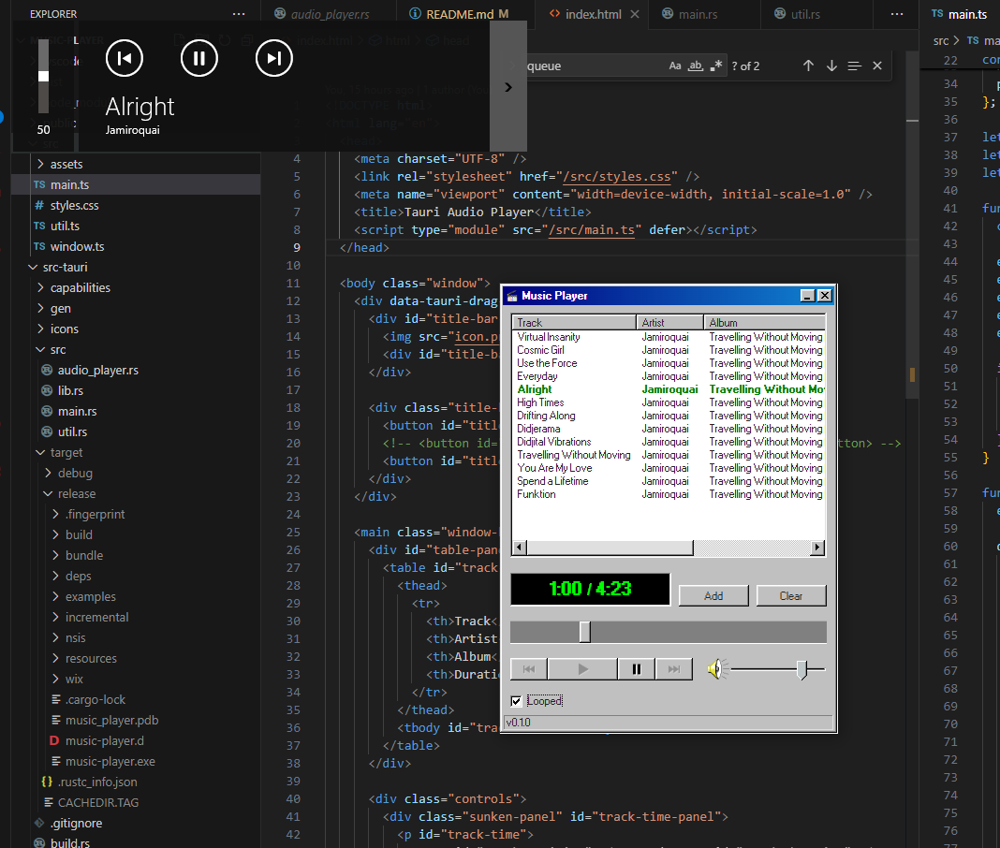

# Music Player

This music player application was developed as a learning project to explore the **Rust** programming language using **Tauri**. It utilizes **Rodio**, **Souvlaki**, and **Lofty** on the Rust backend for audio playback and metadata management, while the frontend is built with **HTML** + **TypeScript**, styled with **98.css** to achieve a nostalgic Windows 98 look.



## Features

- **Supported Formats:** MP3 and FLAC (other formats have not been tested).
- **Queue Management:**
  - Add songs to queue
  - Clear the queue
- **Playback Controls:**
  - Play / Pause
  - Next / Previous track
  - Volume control
  - Toggle queue looping
- **System Integration:**
  - The player can be controlled by the operating system's media controls.

## Technologies Used

### Backend (Rust):

- **[Tauri](https://tauri.app/)** - Lightweight framework for building desktop applications.
- **[Rodio](https://github.com/RustAudio/rodio)** - Audio playback library.
- **[Souvlaki](https://github.com/Sinono3/souvlaki)** - System media control support.
- **[Lofty](https://github.com/Serial-ATA/lofty-rs)** - Metadata parsing for audio files.

### Frontend:

- **HTML + TypeScript** - For the UI.
- **[98.css](https://jdan.github.io/98.css/)** - Windows 98 inspired CSS styling.

## Installation & Running

### Prerequisites:

- Install [Rust](https://www.rust-lang.org/)
- Install [Node.js](https://nodejs.org/)
- Install [Yarn](https://yarnpkg.com/)

### Steps to Run:

1. Clone the repository:

   ```sh
   git clone https://github.com/DylanAlmond/music-player.git
   cd music-player
   ```

2. Install frontend dependencies:

   ```sh
   yarn install
   ```

3. Run the application:
   ```sh
   yarn tauri dev
   ```

## Usage

1. Add songs to the queue using the **Add** button.
2. Use the playback controls to play, pause, skip, or go back to previous tracks.
3. Adjust the volume using the provided slider.
4. Enable or disable queue looping as needed.

## Platform Support

- Currently, the application has been **tested on Windows only.**

## Known Issues

- Other file formats besides MP3 and FLAC are untested and may not work.
- Cross-platform support is not yet implemented or tested.

## Future Improvements

- Cross-platform support (Linux, macOS).
- Additional file format support.
- Improved UI/UX features.

## License

This project is licensed under the MIT License.

## Acknowledgments

Special thanks to the open-source communities of Tauri, Rodio, Souvlaki, and Lofty for their great libraries that made this project possible.

---

_Developed as a learning project to explore Rust and desktop app development._
